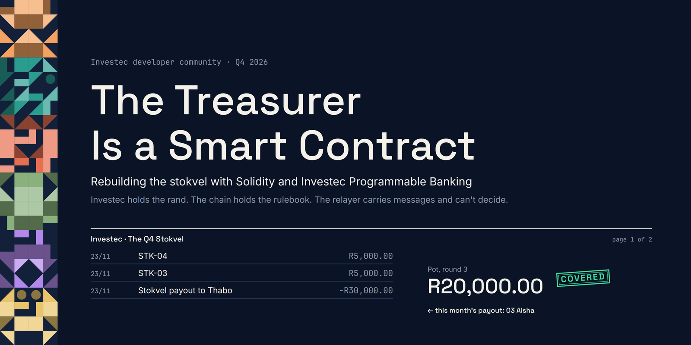
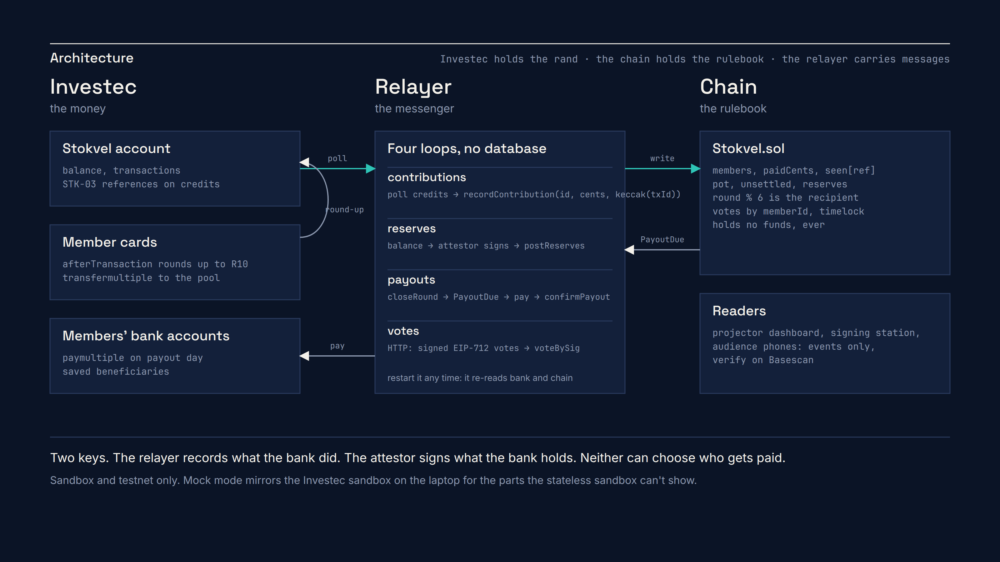
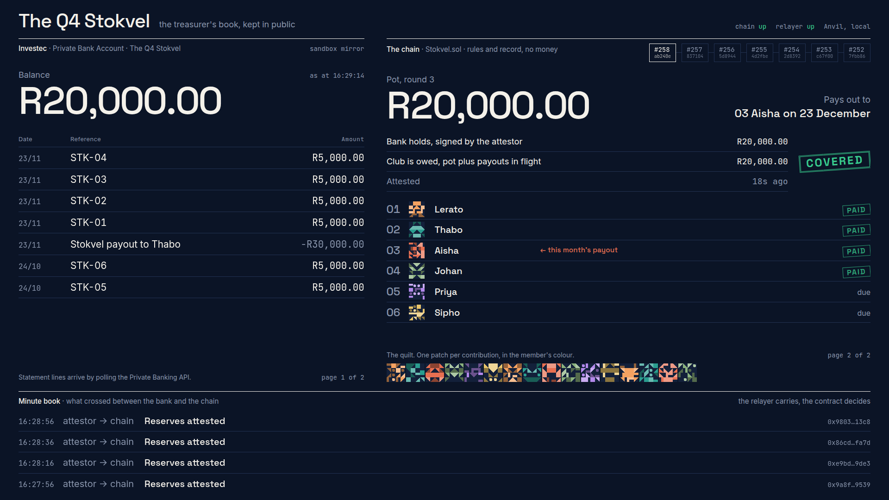
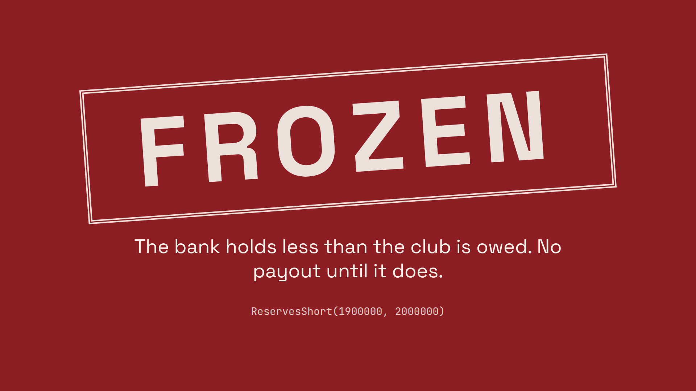
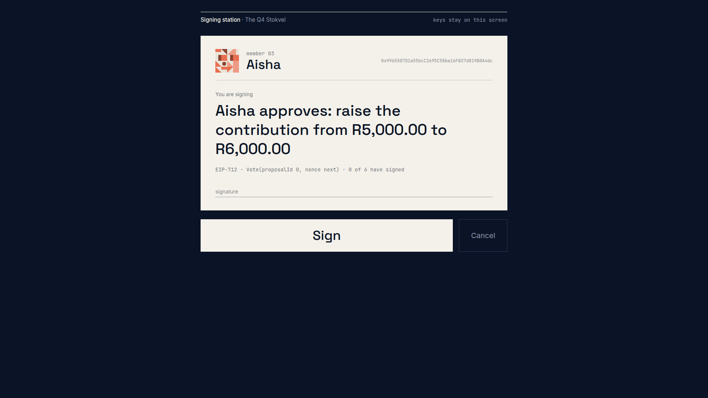
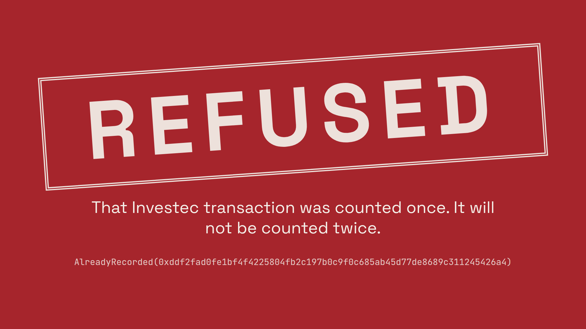
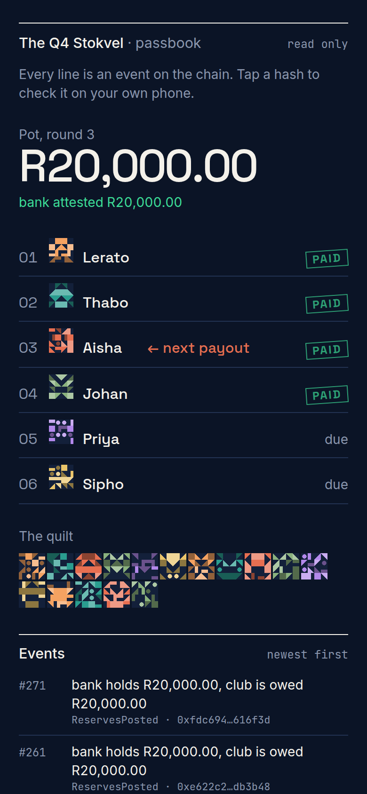
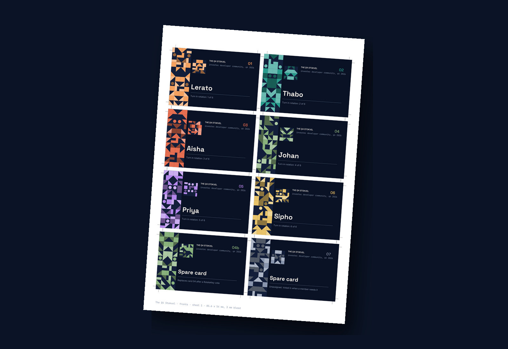
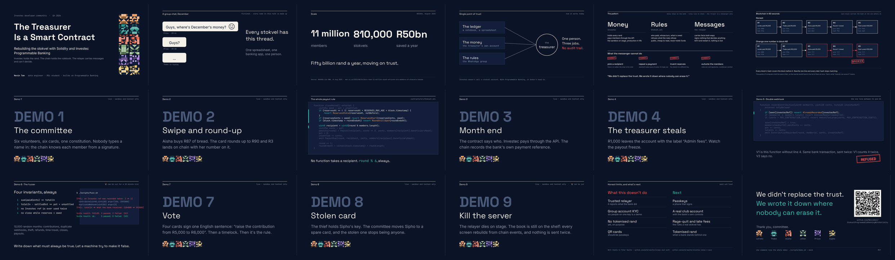

<div align="center">



# The Treasurer Is a Smart Contract

### Rebuilding the stokvel with Solidity and Investec Programmable Banking


Over 11 million South Africans save through stokvels, and they all depend on one person: the
treasurer. In this live-demo talk, six volunteers form a stokvel on stage. Real sandbox money moves
through Investec's API, and a Solidity smart contract enforces the rules. We'll try to steal from
it, double-count it and hijack it live, and watch the code refuse every time.

**Investec holds the rand. The blockchain holds the rulebook. A relayer carries messages between
them and can't make decisions. The contract never holds funds.**

</div>

---

## What's inside

| Folder | What it is |
|---|---|
| [`contracts/`](contracts/) | **The rulebook.** `Stokvel.sol` records contributions in cents, enforces proof of reserves, pays out strictly in rotation, and runs gasless card votes with a timelock and social recovery. `StokvelV1Vulnerable.sol` is the same contract minus one line, for the double-webhook demo. 76 tests, an invariant suite that breaks V1 in seconds, Slither clean |
| [`relayer/`](relayer/) | **The messenger.** Four idempotent loops between Investec and the chain, a mock Investec server that mirrors the sandbox's routes and shapes (and runs the real card code), and a smoke test for the real sandbox |
| [`card/`](card/) | **The round-up.** Programmable card code: R87 at the bakery becomes a R3 contribution with reference `STK-03` |
| [`stage/`](stage/) | **The screens.** The projector dashboard drawn as the treasurer's book, the signing station, the read-only audience page, and the hidden presenter panel. No database: everything is read from the chain |
| [`cards/`](cards/) | **The props.** Nine printable member cards (85.6 x 54 mm, bleed, crop marks) with throwaway testnet keys as QR codes |
| [`slides/`](slides/) | **The PowerPoint**, dark and light, plus the PDF and the generator that builds them |
| [`deck/`](deck/) | **The backup deck**: the same talk as one self-contained HTML file, fonts and diagrams inlined |
| [`talk/`](talk/) | **The words.** [`SPEECH.md`](talk/SPEECH.md) timed slide by slide, [`REHEARSAL.md`](talk/REHEARSAL.md), [`FALLBACK.md`](talk/FALLBACK.md), [`ABSTRACT.md`](talk/ABSTRACT.md), [`EVENT_CHECKLIST.md`](talk/EVENT_CHECKLIST.md) |
| [`docs/`](docs/) | [`ARCHITECTURE.md`](docs/ARCHITECTURE.md), [`INVESTEC_API_NOTES.md`](docs/INVESTEC_API_NOTES.md), [`DEPLOY.md`](docs/DEPLOY.md), [`SECURITY.md`](docs/SECURITY.md), [`PLAN.md`](docs/PLAN.md) |
| [`assets/`](assets/) | Diagrams (SVG and PNG, dark and light), screenshots, card previews, slide renders, fonts with their licences |
| [`scripts/`](scripts/) | `demo.sh` runs the whole thing; `fuzz.sh` is DEMO 6; the secret and dash checks run before every commit |

---

## How it works



Three parts, and the design is about what each one *can't* do. The bank can't know the rules. The
contract can't hold money or see the bank. The relayer can't choose a recipient, invent a balance,
repeat a payment or outvote the members. Two keys sit behind it: the relayer key records what the
bank did, the attestor key signs what the bank holds, and a members' vote can replace either.

The month, in six steps: members pay in with the reference `STK-nn` (some of it as R3 card
round-ups); the relayer records each credit once, keyed by the bank's transaction id; the attestor
signs the balance every 20 seconds; when the round is over the contract closes it and names the
recipient (`round % 6`, always); the relayer pays that member through Investec's `paymultiple`;
and confirms on chain with the bank's own payment reference. More in
[`docs/ARCHITECTURE.md`](docs/ARCHITECTURE.md).

---

## Run the whole demo in one command

```bash
git clone --recurse-submodules https://github.com/Nevvyboi/StokvelProgrammableBankingWithSolidity
cd StokvelProgrammableBankingWithSolidity
./scripts/demo.sh --mock
```

You need [Foundry](https://getfoundry.sh) and Node 20+. The script starts Anvil, deploys both
contracts, seeds two settled months and a mid-month round, starts the mock Investec server, the
relayer (in a restart loop, for the "kill the server" demo) and the stage app, then prints four
URLs:

| URL | Put it on |
|---|---|
| `http://localhost:3000/` | the projector |
| `http://localhost:3000/sign` | the signing station laptop |
| `http://localhost:3000/watch` | the audience's phones (a QR is on the slide) |
| `http://localhost:3000/presenter` | your second screen, never the projector |

Every one of the eight demos is a button on the presenter panel, and every one works with no
network at all.

<table>
  <tr>
    <td width="50%"><br><sub><b>The projector.</b> The treasurer's book, kept in public: the Investec statement on the left page, the rulebook on the right.</sub></td>
    <td width="50%"><br><sub><b>DEMO 4.</b> The treasurer takes R1,000 out. The next attestation is short, and the contract will not pay.</sub></td>
  </tr>
  <tr>
    <td><br><sub><b>The signing station.</b> Scan a card, read one English sentence, press Sign. The key is dropped from memory.</sub></td>
    <td><br><sub><b>DEMO 5.</b> The same bank transaction, sent twice. V1 counts it twice; V2 says no.</sub></td>
  </tr>
</table>

<table>
  <tr>
    <td width="34%"><br><sub><b>The audience page.</b> Read only. Every event links to Basescan.</sub></td>
    <td width="66%"><br><sub><b>The cards.</b> Nine to a print run, each with a throwaway testnet key on the back. Previews here use fake keys.</sub></td>
  </tr>
</table>

Then the tests:

```bash
cd contracts && forge test               # 76 tests on V2
./scripts/fuzz.sh                        # DEMO 6: the invariant suite finds the V1 bug in seconds
cd relayer && npm test && npm run test:e2e   # the mock bank, the card code, all eight demos against Anvil
```

---

## Going live

**Investec sandbox.** Put the public sandbox credentials (developer.investec.com, SA PB Account
Information, "Sandbox") in `relayer/.env` and run `npm run smoke:sandbox`. The relayer works
against the sandbox: OAuth, accounts, balance, transactions, beneficiaries and transfers. One thing
to know: **the sandbox is stateless**, so a transfer returns a real payment reference and then
nothing moves. `./scripts/demo.sh --sandbox` puts the sandbox overlay (`relayer/src/overlay`) in
front of it: a proxy that forwards everything and remembers each transfer the sandbox accepted,
under the sandbox's own reference, folding it into the next balance and transaction read. The
sandbox forgets, the proxy remembers, nothing is invented. The offline default, `--mock`, is a
stateful mirror of the same API. Every field name and endpoint the code relies on is written down
with its source in [`docs/INVESTEC_API_NOTES.md`](docs/INVESTEC_API_NOTES.md).

**Base Sepolia.** Fund three throwaway keys, run `cards/generate.py` so the printed keys are the
members, set `FIRST_ROUND_ENDS_AT` to a time during the talk, and deploy with
`script/Deploy.s.sol`. The audience page then links every event to Basescan.
[`docs/DEPLOY.md`](docs/DEPLOY.md) has the exact commands and what changes on a chain where time
can't be warped.

**The card.** `card/main.js` and a filled in `card/env.json` go into the Investec card IDE. It only
uses `afterTransaction`, because `beforeTransaction` has about two seconds. [`card/README.md`](card/README.md).

---

## Security model

The contract never holds money, so every attack is an attack on the record.

| Attacker | Attack | Defence |
|---|---|---|
| Dodgy treasurer | "Pay me this month" | No recipient setter; rotation changes need a vote plus timelock |
| Dodgy treasurer | Takes rand out of the Investec account | Proof of reserves: `ReservesShort` freezes payouts |
| Compromised relayer | Records the same payment twice | `seen[ref]`: `AlreadyRecorded` |
| Compromised relayer | Invents a huge contribution | `AmountTooLarge` cap, and the reserves mismatch at close |
| Compromised relayer | Pays the wrong person | `beneficiaryHash` check, public events, and members vote to replace the relayer |
| Vote thief | Replays an old signed vote | EIP-712 domain plus per-signer nonce |
| Stolen member card | Votes as the victim | Social recovery with `RotateKey` |

Four invariants hold through 10,000 random months on V2 and break on V1 with a two-call
reproduction. Slither reports nothing above informational. What the code can't enforce (the relayer
is trusted to report what the bank did) is written down rather than hidden. All of it is in
[`docs/SECURITY.md`](docs/SECURITY.md).

---

## The deck



Eighteen slides on the run sheet, plus two appendix slides for questions. Both PowerPoint editions
(dark and light) and the PDF are in [`slides/`](slides/), generated by
`slides/generator/build.py` and rendered slide by slide for checking. The HTML edition in
[`deck/`](deck/) is the same talk in one file: press **N** for notes, **F** for fullscreen, **L**
for the light theme.

---

## Credits

- **Peter Smythe**, for the two Investec community tutorials this talk builds on:
  [invapi-dual-auth](https://github.com/petersmythe/invapi-dual-auth) (how the card runtime
  behaves, the two-second rule, `env.json` handling) and
  [investec-swipe-n-save](https://github.com/petersmythe/investec-swipe-n-save) (the
  swipe-then-transfer pattern the round-up code follows).
- **NASASA via EWN** for the numbers on the scale slide: more than 11 million members, about
  810,000 stokvels, roughly R50bn a year.
  [ewn.co.za, 14 August 2025](https://www.ewn.co.za/2025/08/14/more-than-11-million-south-africans-are-members-of-stokvels-nasasa).
- The Investec developer community's public API simulator and OpenAPI files, which are how the API
  shapes were verified from a build environment that couldn't reach the docs.
- Space Grotesk, Inter and JetBrains Mono, all under the SIL Open Font License, in `assets/fonts`.

## Safety

Everything here runs on the Investec **sandbox** and on **test networks** (local Anvil, Base
Sepolia). No production API, no mainnet, no real money. The member keys are throwaway testnet keys
generated by `cards/generate.py` into a gitignored folder; the previews in this repo use visibly
fake keys. The six members are fictional. The audience page is read only and never shows or accepts
a key. A secret scan and a house-style check run before every commit.

## License

[MIT](LICENSE) © 2026 Nevin Tom

Built for the Investec developer community. If you give this talk, tell me what you broke.
