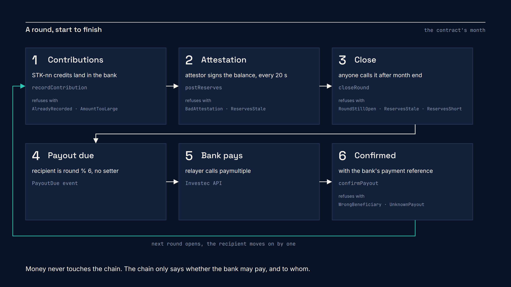

# Architecture

Three parts, and the whole design is about what each one can't do.

| Part | Holds | Can | Can't |
|---|---|---|---|
| **Investec** (the money) | every rand, in a normal Private Bank Account | receive round-ups and contributions, pay members through `paymultiple` | know the rules |
| **Stokvel.sol** (the rulebook) | who paid, whose turn, what is owed, the votes | refuse anything that breaks a rule | hold money, see the bank |
| **The relayer** (the messenger) | nothing durable | carry facts both ways, pay gas for members' signatures | choose a recipient, invent reserves, repeat a payment, outvote members |

Two keys sit behind the relayer process. The **relayer key** records what the bank did
(`recordContribution`, `confirmPayout`). The **attestor key** signs what the bank holds
(`postReserves`). A compromised relayer can't also fake the reserves that would cover its lies. Both
can be rotated out by a members' vote.

## The month

1. Members pay into the stokvel account with the reference `STK-nn`. Some of it arrives as R3
   round-ups from the card code. The relayer polls the account and records each credit once, keyed
   by `keccak256(transaction id)`.
2. Every 20 seconds (5 minutes outside demo mode) the attestor signs `Reserves(cents, at)` for the
   account balance and the relayer posts it.
3. When the round is over, the relayer (or anyone) calls `closeRound`. The contract needs reserves
   under an hour old that cover the pot plus any payout still in flight.
4. `PayoutDue(round, memberId, cents, beneficiaryHash)`. The recipient is `round % 6`. Nothing else
   can choose it.
5. The relayer pays the member through Investec and gets a `PaymentReferenceNumber`.
6. `confirmPayout(round, beneficiaryId, keccak256(paymentRef))`. The beneficiary must hash to the
   one registered for that member at deployment.

## The screens

Every screen reads the contract's state and events straight from the chain, and the relayer's feed
for narration. There is no database. The stage app can be killed and reopened, the relayer can be
killed and restarted, and nothing is lost or sent twice.

- `/` the projector: the treasurer's book. Bank statement left, rulebook right, minute book below.
- `/sign` the signing station: scans a card, shows one English sentence, signs it, forgets the key.
- `/watch` the audience: read only, mobile first, Basescan links.
- `/presenter` the presenter: one button per demo step, and the fallback switch.

## Packages

| Folder | Runtime | Talks to |
|---|---|---|
| `contracts/` | Foundry, Solidity 0.8.24, OpenZeppelin 5 | Anvil or Base Sepolia |
| `relayer/` | Node 20, TypeScript, viem, Hono | Investec API (or the mock), the chain, the stage app |
| `relayer/src/mock` | the same | a stateful mirror of the Investec sandbox with the card runtime |
| `card/` | the Investec programmable card runtime | Investec API |
| `stage/` | Next.js, Tailwind, viem | the chain, the relayer, the mock |
| `cards/` | Python, reportlab | the printer |
| `slides/`, `deck/`, `assets/diagrams` | Python, python-pptx, Playwright | nobody, they're artefacts |

## Why the chain is the database

Because the demo's last act is killing the server. If the dashboard kept its own copy of the
truth, "the relayer died" would be an outage. Because it reads events, it's a shrug. The same
property is what makes the audience page honest: a phone in the room reads the same contract the
projector does, through a block explorer neither of us controls.

## The sandbox forgets, the overlay remembers

Investec's sandbox is stateless: a transfer answers with a real payment reference and then nothing
changes. Sandbox mode therefore runs through `relayer/src/overlay`, a transparent proxy on port
4200. Every call goes to the sandbox unchanged. When the sandbox accepts a `transfermultiple` or
`paymultiple`, the overlay writes one line keyed by the sandbox's `PaymentReferenceNumber`, and on
every later read of a balance, a transaction list or the beneficiaries it folds those lines in after
the sandbox's own rows. The relayer's poll cursor, the card code and the stage read the overlay and
can't tell. The overlay never creates a reference, a row or a rand the sandbox didn't first accept;
its file in `.demo/` is the memory, and `POST /__mock/reset` empties it.

`relayer/src/mock` is the offline stand-in: a stateful mirror of the same routes and shapes with a
pool account, the treasurer's account and six saved beneficiaries. With `MOCK_STATELESS=true` it
forgets like the real sandbox, which is how the overlay is tested without network. Details and
sources in [INVESTEC_API_NOTES.md](INVESTEC_API_NOTES.md).
